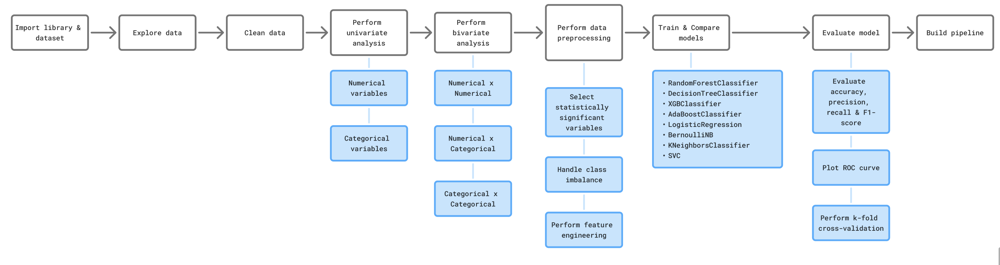
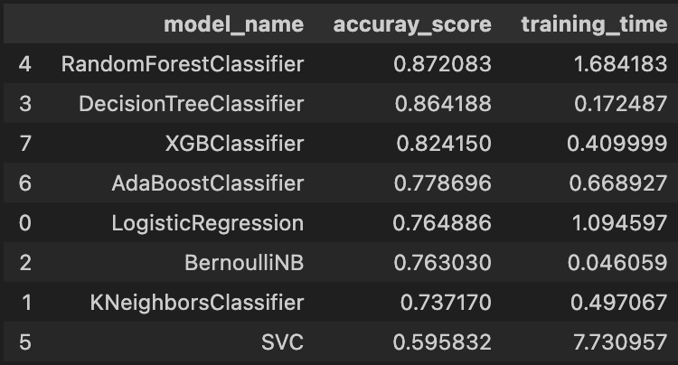

# Customer Churn Dataset

## Overview
This dataset contains customer information for a telecommunications company, including demographics, service subscriptions, payment methods, and churn status.  
It is designed for churn analysis and prediction tasks.

### Column Descriptions

- **CustomerID**: Unique identifier for each customer.  
- **Gender**: Customer's gender (Male/Female).  
- **SeniorCitizen**: Indicates if the customer is a senior citizen (1 = Yes, 0 = No).  
- **Partner**: Indicates if the customer has a spouse/partner (Yes/No).  
- **Dependents**: Indicates if the customer has dependents (Yes/No).  
- **Tenure**: Number of months the customer has stayed with the company.  
- **PhoneService**: Whether the customer has phone service (Yes/No).  
- **MultipleLines**: Whether the customer has multiple phone lines (Yes/No/No phone service).  
  - If `PhoneService` is No, this will be "No phone service".  
- **InternetService**: Type of internet service (DSL/Fiber optic/No).  
- **OnlineSecurity**: Whether the customer has online security service (Yes/No).  
- **OnlineBackup**: Whether the customer has online backup service (Yes/No).  
- **DeviceProtection**: Whether the customer has device protection service (Yes/No).  
- **TechSupport**: Whether the customer has tech support service (Yes/No).  
- **StreamingTV**: Whether the customer has streaming TV service (Yes/No).  
- **StreamingMovies**: Whether the customer has streaming movies service (Yes/No).  
  - If `InternetService` is "No", related columns may contain "No internet service" (can be standardized to "No").  
- **Contract**: Type of contract (Month-to-month/One year/Two year).  
- **PaperlessBilling**: Whether the customer uses paperless billing (Yes/No).  
- **PaymentMethod**: Payment method (Electronic check/Mailed check/Bank transfer (automatic)/Credit card (automatic)).  
- **MonthlyCharges**: Amount charged to the customer monthly.  
- **TotalCharges**: Total amount charged to the customer.  
- **Churn**: Indicates if the customer has left the service (Yes/No).  

#### Notes
- Values like "No phone service" and "No internet service" appear when the customer does not subscribe to those services. They can be standardized to "No" for analysis purposes.

## Problems
- High customer churn rate impacts company revenue and customer lifetime value.
- Lack of clear understanding of which factors contribute most to customer churn.
- Difficulty in targeting retention campaigns effectively.
- Imbalanced dataset, where the number of churned customers is much smaller than non-churned customers, can affect model performance

## Solutions
- Perform exploratory data analysis (EDA) to identify key churn drivers.
- Apply data preprocessing steps such as handling missing values, encoding categorical variables, and scaling numeric features.
- Handle class imbalance using techniques like SMOTE or class weighting.
- Build and compare multiple machine learning models (e.g., Logistic Regression, Random Forest, XGBoost) to select the best performing one.
- Use the selected model to predict churn and help the business target at-risk customers with retention strategies.





## Project Organization
```
.
├── README.md                         : Project documentation  
├── Logistic_Regression_model.pkl     : Trained Logistic Regression model  
├── model_pipeline.pkl                : Serialized end-to-end ML pipeline (preprocessing + model)  
├── ML-Classification.ipynb           : Jupyter notebook for data preprocessing, model training, and evaluation  
├── telco_customer_churn.csv          : Customer churn dataset used for analysis  
```

